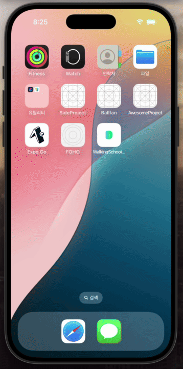
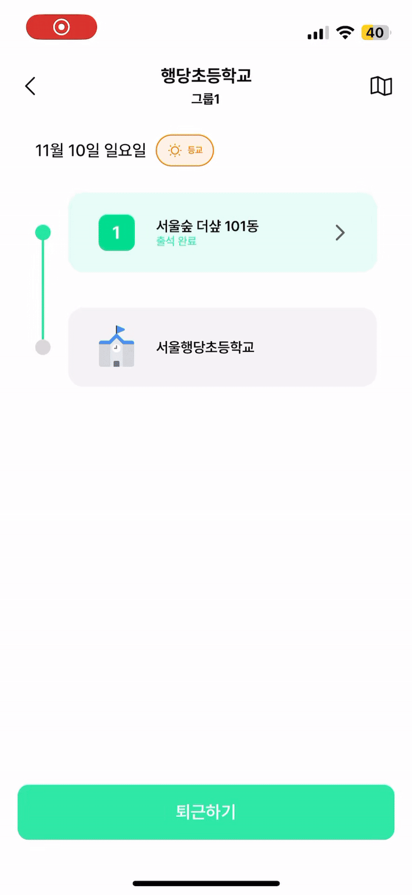
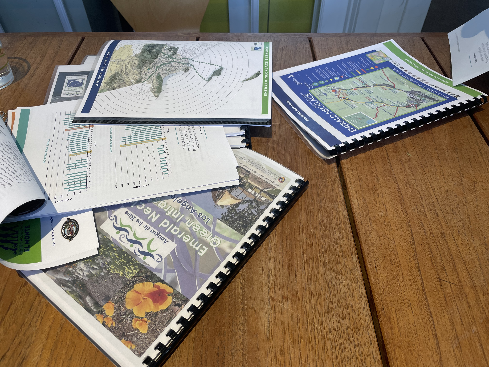
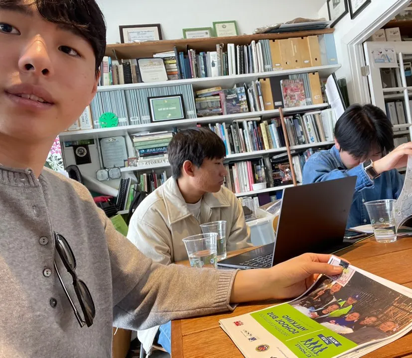
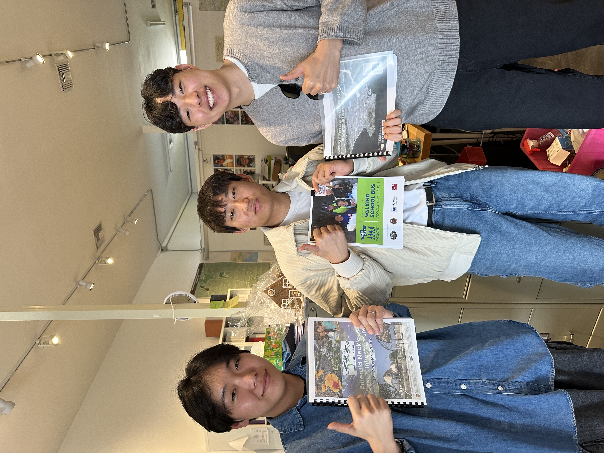

# ⚾️ 워킹스쿨버스 활성화를 위한 앱 "동행"  

## 프로젝트 소개

🏷 **프로젝트 명 : 동행**

🗓️ **프로젝트 기간 : 2024.01.01 ~ 2024.12.21**

👥 **구성원 : 김효민(PM), 김수환(FE), 김동현(FE), 임진영(BE / FE)**

🏆 **수상 : 아주대학교
파란학기 내일의 주인공상 (우수상)**

---

### 😎 서비스 구경 바로가기

**📱 서비스 인스타그램 : https://www.instagram.com/dhang_ajou/**

**🎥 서비스 소개 자료 및 영상 : https://buly.kr/CWuiumi**


----

### ✅ 기획 배경 및 서비스 소개


---


## 💌 서비스 화면 및 기능 소개

### ✅ 서비스 흐름도

----

**🎫 로그인**
- 인솔자용과 학부모용, 두 가지 버전으로 로그인을 진행할 수 있습니다.
<p align="center">
  
</p>

----


**🚍 운행 시작 및 출석 체크**
- 인솔자는 운행 탭에서 출근하기 버튼을 누르면 운행이 시작됩니다. 
- 여러 인솔자가 동시에 참여하더라도 WebSocket 기술을 활용해 자녀의 출석을 실시간으로 빠르게 체크할 수 있습니다.
- 한 인솔자가 특정 경유지의 출석을 완료하면, 다른 인솔자의 화면에도 즉시 반영됩니다.
- 본인의 자녀 출석이 완료되면, 학부모에게 FCM 푸시 알림이 자동 전송됩니다.
<p align="center">
  
</p>

----

**👨‍👩‍👧‍👦 운행 시작 시 학부모 운행 현황 확인**
- 운행이 진행되는 동안 학부모는 운행 탭에서 지도를 통해 운행 현황을 확인할 수 있습니다.
- 대표 인솔자의 실시간 위치 정보가 웹소켓을 통해 그룹 내 학부모들에게 전송됩니다.
- 학부모는 대표 인솔자의 위치를 기반으로 운행 현황을 실시간 확인할 수 있습니다.
- 자녀가 어느 경유지에 위치하고, 출석 여부(출석/대기)를 확인할 수 있습니다.
- 경유지 코스의 전체 경로도 지도에서 확인할 수 있습니다.
- 운행이 종료되면, 실시간 위치 서비스도 자동 종료됩니다.
<p align="center">
  
</p>

----

**🏁 퇴근하기**
- 모든 경유지의 출석 확인이 완료되면, 화면 하단에 퇴근하기 버튼이 생성됩니다.
- 퇴근하기 버튼을 누르면 운행이 종료되며, 학부모에게 전송되던 실시간 위치 정보도 중단됩니다.
- 운행 기록은 스케줄링을 통해 다음 날 오전 7시에 자동 초기화됩니다.
<p align="center">
  
</p>

----


**✍️ 그룹 공지 작성하기**
- 인솔자는 그룹 공지에 운행 상태나, 날씨 등의 정보를 사진과 글을 함께 남길 수 있습니다.
<p align="center">
  
</p>

----

**📢 그룹 공지 조회하기**
- 학부모는 자녀들의 운행이 안전하게 진행되었는지 확인할 수 있습니다.
- 학부모는 좋아요 버튼을 눌러 인솔자에게 감사의 마음을 전달할 수 있습니다.
<p align="center">
  
</p>

----


**🚫 결석 신청하기**
- 학부모는 결석 신청하기 또는 그룹 탭에서 자녀의 결석을 신청할 수 있습니다.
- 결석을 신청할 자녀를 선택한 뒤, 결석 날짜를 지정합니다.
- 결석 신청이 완료되면, 자녀가 속한 그룹의 인솔자에게 FCM 푸시 알림이 전송됩니다.
<p align="center">
  
</p>

----


**💬 메시지 보내기**
- 학부모는 결석 신청하기 또는 그룹 탭에서 특이사항이 발생했을 때 인솔자에게 메시지를 보낼 수 있습니다.
- 메시지를 보낼 자녀를 선택한 뒤, 메시지를 작성합니다.
- 메시지를 전송하면, 해당 그룹의 모든 인솔자에게 FCM 푸시 알림이 전송됩니다.
- 인솔자는 아이들의 정보 조회하기 메뉴에서 메시지를 확인할 수 있습니다.
<p align="center">
  
</p>


----


**🔔 알림 내역 확인하기**
- 인솔자는 학부모로부터 온 결석 신청, 메시지, 운행 시작 등의 알림을 FCM 푸시 알림으로 받습니다.
- 알림 탭에서 누적된 알림들을 한눈에 확인할 수 있습니다.
- 초록색 표시는 아직 확인되지 않은 알림을 의미합니다.
- 알림은 3개월이 지나면 자동 삭제됩니다.
<p align="center">
  
</p>


----


**👧 자녀 프로필 수정하기**
- 학부모는 마이 탭에서 자녀 정보를 수정할 수 있습니다.
- 자녀의 프로필 사진, 이름, 학교, 학년, 특이사항 등을 변경할 수 있습니다.
- 특히 특이사항을 수정하면 즉시 업데이트되어, 인솔자가 학생 정보를 조회할 때 반영된 내용을 확인할 수 있습니다.
<p align="center">
  
</p>


----
### 🚦 성동구청과 함께한 서울행당초등학교 노선 앱 시행 테스트
- 저희 ‘동행’ 팀은 성동구청과 협업하여 실제 워킹스쿨버스가 운행되는 성동구 한 코스에서 앱 테스트를 진행했습니다.
- 인솔자분들께 ‘동행’ 앱을 전달드린 후, 실제 운행 과정에서 직접 사용해보는 테스트를 진행했습니다.
- 인솔자분들은 기존의 수기 기록이나 카톡방 전달 방식 대신, 클릭 한 번으로 실시간 출석 체크가 가능해진 점을 경험하고 긍정적인 평가를 남겨주셨습니다.
- 테스트 종료 후, 인솔자분들로부터 앱에 대한 피드백도 직접 전달받을 수 있었습니다.
<p align="center">
  
  
</p>

----
### 🇺🇸 워킹스쿨버스 본고지 미국 방문 및 운영 단체 인터뷰
- 한국에서는 표준화된 운영 방안의 부재로 워킹스쿨버스의 전국 확장이 어렵다는 점을 확인하고, 아동 보행 안전에 기여하고자 워킹스쿨버스의 본고지인 미국을 방문했습니다.
- 교내 글로벌 리더십 프로그램(GLP)을 통해 LA에 위치한 Amigos de los 라는 워킹스쿨버스 비영리 단체와 접촉하여 현지 운영진과 인터뷰를 진행했습니다.
- 이 과정에서 앱 개발과 관련된 기능적 조언, 그리고 현지의 운영 방식 및 체계에 관한 자료와 피드백을 받을 수 있었습니다.
- 인터뷰와 자료를 통해 얻은 인사이트를 기반으로, 실제 앱 기능에 반영하여 더 체계적이고 현장 친화적인 서비스로 발전시켰습니다.
<p align="center">
  
  
</p>
<p align="center">

</p>


---

## 🛠 기술 스택

### FE
<p>
  
  
  
  
  
  
   
</p>

### BE
<p>
	
	
	
    
    
</p> 

### DB
<p>
  
  
</p>

### Dev-Ops
<p>
    
	
	
	
    
</p>

### Communication
<p>
	
	
	
    
</p>


## 🗂 프로젝트 구조

### FE
#### https://github.com/jinyoung1226/WalkingSchoolBus

```markdown
└─📦 src
  ├─📂 api
  ├─📂 assets
  │  ├─📂 tabBarIcon
  │  ├─📂 fonts
  │  ├─📂 icons
  ├─📂 components
  ├─📂 nav
  ├─📂 src_guardian
  │  ├─📂 BottomTab
  │  ├─📂 Screens
  │  ├─📂 guardianStore
  │  ├─📂 hooks
  │  ├─📂 nav
  ├─📂 src_parent
  │  ├─📂 BottomTab
  │  ├─📂 Screens
  │  ├─📂 hooks
  │  ├─📂 nav
  ├─📂 store
  ├─📂 styles
  ├─📂 utils
  ├─📂 websocket 
  └─📜 App.js
```

---

### BE
#### https://github.com/jinyoung1226/donghang

```markdown
├─📂 java
    📦 donghang
    ├─📂 config
    ├─📂 domain
    │  ├─📂 alert
    │  ├─📂 attendance
    │  ├─📂 auth
    │  ├─📂 group
    │  ├─📂 guardian
    │  ├─📂 location
    │  ├─📂 mail
    │  ├─📂 message
    │  └─📂 notice
    │  └─📂 notification
    │  └─📂 parent
    │  └─📂 student
    │  └─📂 token
    │  └─📂 waypoint
    ├─📂 global
    │  ├─📂 api
    │  ├─📂 dto
    │  ├─📂 exception
    │  └─📂 service
    ├─🧩 WsbApplication
```

## 📜 프로젝트 산출물

### 시스템 아키텍쳐

---

### ERD


---
### API 명세서
#### 학부모 버전

#### 인솔자 버전

---

### 메뉴 트리
#### 학부모 버전

#### 인솔자 버전

---

### 정보구조도
#### 학부모 버전

#### 인솔자 버전

----

## 💙 팀원 소개
| 김효민 (PM)                                                                                                    | 임진영 (BE/FE)                                                                                                                                                                               |
|-------------------------------------------------------------------------------------------------------------|-------------------------------------------------------------------------------------------------------------------------------------------------------------------------------------------|
| 기획 및 디자인 총괄 <br> Figma 기반 UI/UX 설계 <br> 기능 요구사항 정의 및 흐름도 작성 <br> 성동구청 교통행정팀 컨택 <br> 학부모 및 인솔자 인터뷰 및 설문조사 진행 | 백엔드 총괄 <br> 학부모·인솔자 API 개발 <br> CI/CD 파이프라인 및 Docker, Nginx 환경 구축 <br> WebSocket 기반 실시간 위치 공유 및 출석 동기화 로직 구현 <br> FCM 푸시 알림 기능 구현 <br> 프론트엔드 프로젝트 구조 설계 <br> Kakao Map API 기반 지도 인터페이스 구축 |
| https://github.com/rlagyals                                                                                 | https://github.com/jinyoung1226                                                                                                                                                           |

| 김수환 (FE)                                                                                                                                                | 김동현 (FE)                                                        |
|---------------------------------------------------------------------------------------------------------------------------------------------------------|-----------------------------------------------------------------|
| 프론트엔드 총괄 <br> Zustand와 React Query 기반 상태 관리 구조 설계 <br> StompJS 기반 웹소켓 실시간 통신 구조 설계 <br> 실시간 출석 관리 기능 구현 <br> 실시간 위치정보 제공 기능 구현 <br> fireBase 푸시알림 기능 구현 | 프론트엔드 <br> 회원가입 및 로그인 페이지 구현 <br> 그룹 공지 페이지 구현 <br> 홈 및 마이 탭 구현 |
| https://github.com/hwansoo17                                                                                                                            | https://github.com/DongDongsqq                                  |